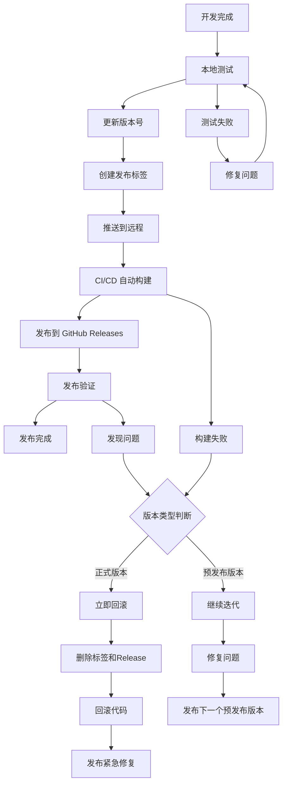

# 🚀 My Universe 发布指南

本文档详细介绍了 My Universe 项目的完整发布流程，包括版本管理、自动化构建和发布验证。

## 📋 发布流程概览



## 🛠️ 发布前准备

### 1. 环境检查
确保本地开发环境配置正确：

```bash
# 检查 Node.js 版本
node --version  # 需要 v18+ 

# 检查 npm 版本
npm --version

# 检查 Rust 环境
rustc --version
cargo --version

# 检查 Tauri CLI
npm run tauri --version
```

### 2. 代码质量检查
在发布前确保代码质量：

```bash
# 运行代码检查
npm run lint

# 运行类型检查
npm run build

# 检查 Rust 代码格式
cd src-tauri
cargo fmt --check
cargo clippy --all-targets --all-features -- -D warnings
cd ..

# 本地 Tauri 构建测试
npm run tauri build -- --debug
```

### 3. 功能测试
```bash
# 启动开发服务器测试
npm run dev

# 构建并测试生产版本
npm run build
npm run preview
```

## 📦 版本管理

### 版本号规范
遵循 [语义化版本控制](https://semver.org/lang/zh-CN/)：

- **主版本号 (MAJOR)**: 不兼容的 API 修改
- **次版本号 (MINOR)**: 向后兼容的功能性新增
- **修订号 (PATCH)**: 向后兼容的问题修正
- **预发布版本**: 如 `1.0.0-alpha.1`、`1.0.0-beta.1`、`1.0.0-rc.1`

### 构建目标配置 🔧

为了简化构建过程，我们配置了特定的构建目标：

#### Windows
- **NSIS (.exe)**: Windows 安装程序，支持完整的语义化版本号
- **不构建 MSI**: 避免版本号兼容性问题

#### macOS
- **DMG**: macOS 磁盘镜像

#### Linux  
- **DEB**: Debian/Ubuntu 安装包
- **AppImage**: 便携版应用

### 使用 npm version 管理版本

```bash
# 补丁版本（修复 bug）
npm version patch
# 例: 1.0.0 -> 1.0.1

# 次版本（新功能）
npm version minor  
# 例: 1.0.1 -> 1.1.0

# 主版本（破坏性更改）
npm version major
# 例: 1.1.0 -> 2.0.0

# 预发布版本
npm version prerelease --preid=alpha
# 例: 1.0.0 -> 1.0.1-alpha.0

npm version prerelease --preid=beta
# 例: 1.0.0 -> 1.0.1-beta.0

npm version prerelease --preid=rc
# 例: 1.0.0 -> 1.0.1-rc.0
```

### 自定义版本号
```bash
# 直接指定版本号
npm version 1.2.3

# 预发布版本
npm version 1.2.3-beta.1
npm version 1.2.3-alpha.2
npm version 1.2.3-rc.1
```

### 版本发布策略

#### 🔴 正式版本 (Production Release)
- **格式**: `v1.2.3`（无后缀）
- **用途**: 生产环境发布，面向最终用户
- **质量要求**: 必须经过充分测试，确保稳定性
- **回滚策略**: 发现问题**立即回滚**，保护用户体验

#### 🟡 预发布版本 (Pre-release)
- **Alpha 版本**: `v1.2.3-alpha.1`
  - 早期内测版本，功能可能不完整
  - 主要用于内部测试和开发验证
- **Beta 版本**: `v1.2.3-beta.1`
  - 功能基本完整，用于公开测试
  - 收集用户反馈，修复问题
- **RC 版本**: `v1.2.3-rc.1`
  - 发布候选版本，接近最终版本
  - 最后的测试阶段
- **回滚策略**: **不回滚**，通过发布新版本迭代修复

## 🚀 完整发布流程

### 方式一：使用脚本发布（推荐）

创建发布脚本让流程更简单：

```bash
# 补丁版本发布
npm run release:patch

# 次版本发布  
npm run release:minor

# 主版本发布
npm run release:major

# 预发布版本
npm run release:beta
```

### 方式二：手动发布

#### 步骤 1: 确保代码最新
```bash
# 切换到主分支
git checkout main

# 拉取最新代码
git pull origin main

# 确保工作区干净
git status
```

#### 步骤 2: 更新版本号
```bash
# 根据更改类型选择合适的版本更新
npm version patch  # 或 minor/major

# 这将会：
# 1. 更新 package.json 中的版本号
# 2. 更新 package-lock.json
# 3. 创建一个 git commit
# 4. 创建一个 git tag
```

#### 步骤 3: 同步 Tauri 版本号
```bash
# 手动更新 src-tauri/tauri.conf.json 中的版本号（与 package.json 保持一致）
# 或者使用脚本自动同步
npm run sync-version
```

#### 步骤 4: 推送发布
```bash
# 推送提交和标签
git push origin main --follow-tags

# 或者分别推送
git push origin main
git push origin --tags
```

#### 步骤 5: 监控构建
1. 访问 GitHub Actions 页面
2. 观察 "Release - 版本发布" 工作流
3. 确认所有平台构建成功

## 📊 版本发布示例

### 发布补丁版本 (Bug 修复)
```bash
# 假设当前版本是 v1.2.0
git checkout main
git pull origin main

# 确保所有测试通过
npm run lint
npm run build

# 更新补丁版本
npm version patch
# 输出: v1.2.1

# 推送发布
git push origin main --follow-tags
```

### 发布次版本 (新功能)
```bash
# 假设当前版本是 v1.2.1
git checkout main
git pull origin main

# 更新次版本
npm version minor
# 输出: v1.3.0

# 推送发布
git push origin main --follow-tags
```

### 发布预发布版本
```bash
# 创建 beta 版本
npm version prerelease --preid=beta
# 输出: v1.3.1-beta.0

# 推送发布
git push origin main --follow-tags
```

## 🔧 发布脚本配置

在 `package.json` 中添加发布脚本：

```json
{
  "scripts": {
    "release:patch": "npm version patch && git push origin main --follow-tags",
    "release:minor": "npm version minor && git push origin main --follow-tags", 
    "release:major": "npm version major && git push origin main --follow-tags",
    "release:beta": "npm version prerelease --preid=beta && git push origin main --follow-tags",
    "release:alpha": "npm version prerelease --preid=alpha && git push origin main --follow-tags",
    "release:rc": "npm version prerelease --preid=rc && git push origin main --follow-tags",
    "sync-version": "node scripts/sync-version.js"
  }
}
```

## ✅ 发布后验证

### 1. 检查 GitHub Releases
- 访问 `https://github.com/your-username/my-universe/releases`
- 确认新版本已创建
- 验证所有平台的构建产物都已上传

### 2. 下载测试
分别下载不同平台的安装包进行测试：
- Windows: `.msi` 和 `.exe` 文件
- macOS: `.dmg` 文件  
- Linux: `.AppImage` 和 `.deb` 文件

### 3. 功能验证
- 安装应用并启动
- 测试核心功能
- 检查版本信息显示是否正确

## 🚨 故障处理

### 构建失败
```bash
# 查看失败的 Actions
# 1. 进入 GitHub Actions 页面
# 2. 点击失败的工作流
# 3. 查看错误日志

# 如果需要重新触发构建
git tag -d v1.2.3  # 删除本地标签
git push origin :refs/tags/v1.2.3  # 删除远程标签
# 修复问题后重新发布
```

### 版本回滚策略

根据版本类型采用不同的回滚策略：

#### 🔴 正式版本（立即回滚）
对于正式版本（如 `v1.2.3`），如果发现严重问题需要**立即回滚**：

```bash
# 1. 删除有问题的标签和发布
git tag -d v1.2.3  # 删除本地标签
git push origin :refs/tags/v1.2.3  # 删除远程标签

# 2. 在 GitHub 上删除对应的 Release（手动操作）

# 3. 如果代码有问题，回滚提交
git reset --hard HEAD~1  # 回滚到上一个提交
git push origin main --force-with-lease  # 强制推送（谨慎使用）

# 4. 立即发布修复版本
git checkout main
git pull origin main
# 修复问题...
npm run release:patch  # 发布紧急修复版本
```

#### 🟡 预发布版本（不回滚，继续迭代）
对于预发布版本（如 `v1.2.3-beta.1`、`v1.2.3-alpha.2`），**不进行回滚**，而是继续迭代：

```bash
# 不删除现有的预发布版本，而是发布新的预发布版本

# 修复问题后发布下一个预发布版本
npm run release:beta   # 例：v1.2.3-beta.1 -> v1.2.3-beta.2
# 或
npm run release:alpha  # 例：v1.2.3-alpha.1 -> v1.2.3-alpha.2

# 如果问题严重，可以跳到下一个 RC 版本
npm run release:rc     # 例：v1.2.3-beta.2 -> v1.2.3-rc.0
```

#### 🔍 版本类型判断
判断是否为正式版本的方法：

```bash
# 检查当前标签是否为正式版本
git describe --tags --abbrev=0 | grep -E '^v[0-9]+\.[0-9]+\.[0-9]+$'

# 如果返回结果，说明是正式版本，需要立即回滚
# 如果没有返回结果，说明是预发布版本，继续迭代
```

### 版本号错误
```bash
# 如果版本号更新错误，需要手动修正
# 1. 修改 package.json 中的版本号
# 2. 修改 src-tauri/tauri.conf.json 中的版本号
# 3. 提交更改
git add .
git commit -m "fix: 修正版本号"

# 4. 创建正确的标签
git tag v1.2.3
git push origin main --follow-tags
```

## 📝 发布清单

发布前请确认以下事项：

- [ ] 所有功能开发完成
- [ ] 代码已合并到 main 分支
- [ ] 本地测试通过
- [ ] CI 检查通过  
- [ ] 版本号更新正确
- [ ] Tauri 配置版本号已同步
- [ ] 发布说明准备就绪
- [ ] 推送标签到远程仓库
- [ ] GitHub Actions 构建成功
- [ ] 所有平台安装包可用
- [ ] 基本功能验证通过

## 🎯 最佳实践

1. **遵循版本规范**: 严格按照语义化版本控制
2. **充分测试**: 发布前进行全面测试
3. **渐进发布**: 先发布预发布版本进行测试
4. **及时沟通**: 重要版本发布前通知团队
5. **文档更新**: 及时更新相关文档
6. **监控反馈**: 发布后关注用户反馈和问题报告
7. **回滚策略**: 
   - 🔴 **正式版本**: 发现问题立即回滚，保护用户体验
   - 🟡 **预发布版本**: 不回滚，通过迭代修复问题
8. **版本管理**: 使用预发布版本充分测试，确保正式版本质量

---

💡 **提示**: 建议将此文档加入团队知识库，确保所有开发者都了解发布流程。 